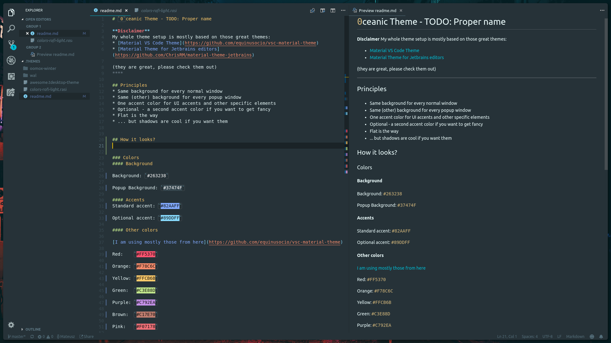
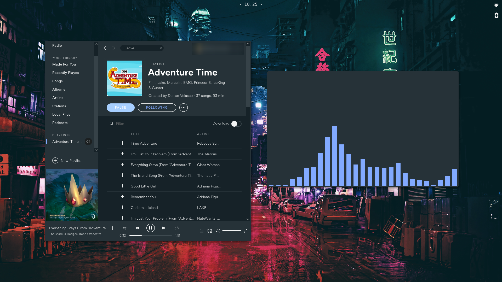
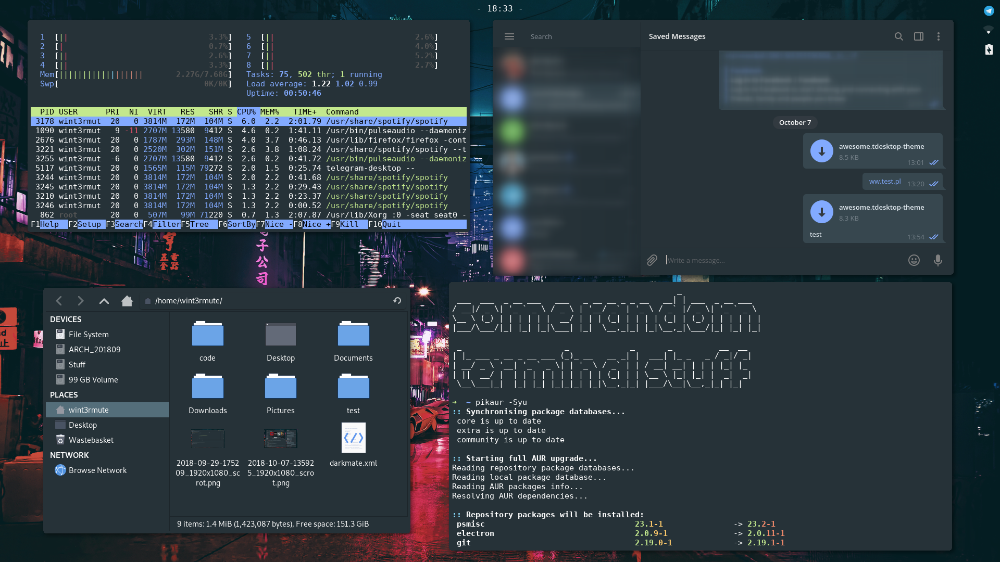
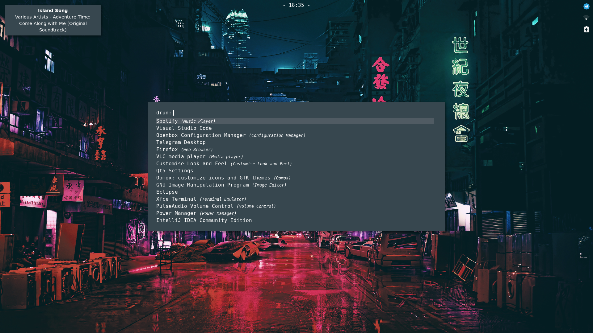

# `0`ceanic Theme - TODO: Proper name

**Disclaimer**
My whole theme setup is mostly based on those great themes:
* [Material VS Code Theme](https://github.com/equinusocio/vsc-material-theme)
* [Material Theme for Jetbrains editors](https://github.com/ChrisRM/material-theme-jetbrains)

(they are great, please check them out)
****

## Principles
* Same background for every normal window
* Same (other) background for every popup window
* One accent color for UI accents and other specific elements
* Optional - a second accent color if you want to get fancy
* Flat is the way
* ... but shadows are cool if you want them

## How it looks?

### Colors
#### Background

Background: `#263238`

Popup Background: `#37474F`

#### Accents
Standard accent: `#82AAFF`

Optional accent: `#89DDFF`

#### Other colors

[I am using mostly those from here](https://github.com/equinusocio/vsc-material-theme)

Red:    `#FF5370`

Orange: `#F78C6C`

Yellow: `#FFCB6B`

Green:  `#C3E88D`

Purple: `#C792EA`

Brown:  `#C17E70`

Pink:   `#F07178`

Violet: `#BB80B3`

